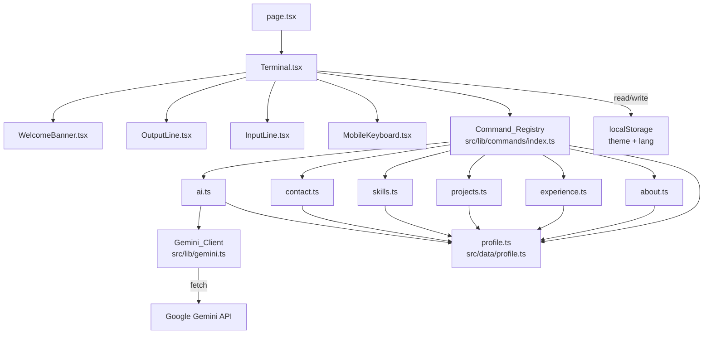
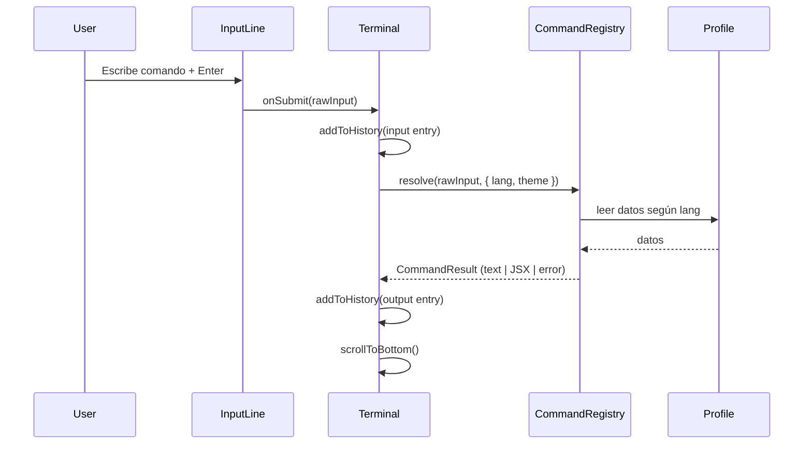
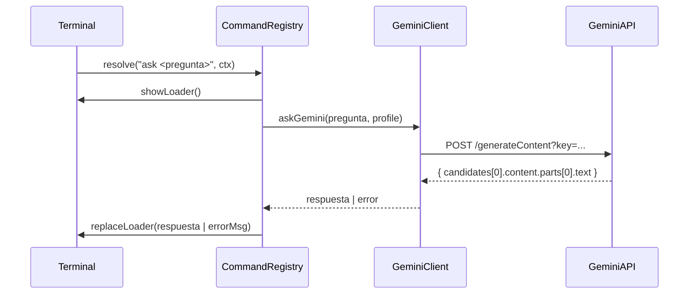

# Design Document — Terminal Portfolio

## Overview

Portfolio profesional interactivo con interfaz de terminal de comandos, deployado como sitio estático en GitHub Pages. La aplicación emula una terminal Unix en el browser: el usuario escribe comandos para navegar contenido profesional (bio, experiencia, proyectos, skills, contacto), cambia temas visuales e idiomas, e interactúa con una IA (Google Gemini) que responde preguntas sobre el perfil.

### Decisiones de diseño clave

- **Static-only**: Next.js `output: 'export'` — sin servidor, sin API Routes, sin SSR. Todo es client-side.
- **Single source of truth**: `src/data/profile.ts` contiene toda la información profesional. Ningún texto de contenido está hardcodeado en UI.
- **Command pattern**: el Command_Registry desacopla el parsing de comandos de su ejecución y del renderizado.
- **Tema e idioma persistidos**: `localStorage` guarda las preferencias entre sesiones.
- **Accesibilidad first**: `aria-live`, `aria-label`, contraste WCAG 2.1 AA en todos los temas.

---

## Architecture



### Flujo de ejecución de un comando



### Flujo del comando `ask`



---

## Components and Interfaces

### `Terminal.tsx` — Componente principal

Responsable de: estado global de la terminal (history, theme, lang, historyIndex), dispatch de comandos, scroll automático.

**Props:** ninguna (es el root component)

**State:**
```typescript
interface TerminalState {
  history: HistoryEntry[];        // Todas las entradas visibles
  inputValue: string;             // Contenido del input actual
  theme: Theme;                   // 'dark' | 'light' | 'matrix'
  lang: Lang;                     // 'es' | 'en'
  commandHistory: string[];       // Solo los comandos ejecutados (para ArrowUp/Down)
  historyIndex: number;           // Cursor en commandHistory (-1 = no navegando)
  isLoading: boolean;             // true mientras ask está en vuelo
}
```

**Responsabilidades:**
- Inicializar theme y lang desde `localStorage` al montar (con fallbacks `dark` / `es`)
- Renderizar `WelcomeBanner` como primera entrada del history
- Delegar la ejecución al Command_Registry
- Gestionar navegación de historial con ArrowUp/ArrowDown
- Hacer `scrollIntoView` en el último elemento al actualizar history
- Enfocar el input al hacer click en el panel (mobile)

---

### `InputLine.tsx`

**Props:**
```typescript
interface InputLineProps {
  value: string;
  onChange: (val: string) => void;
  onSubmit: (val: string) => void;
  onArrowUp: () => void;
  onArrowDown: () => void;
  disabled: boolean;              // true mientras ask está en vuelo
  prompt: string;                 // e.g. "visitor@portfolio:~$"
}
```

**Responsabilidades:**
- Renderizar el prompt y el `<input>` con `aria-label="Entrada de comandos de la terminal"`
- Cursor parpadeante CSS (animation keyframes 500ms on/off)
- Capturar Enter, ArrowUp, ArrowDown y delegarlos via callbacks
- `autoFocus` en mount; fuente mínima 14px (previene zoom iOS)

---

### `OutputLine.tsx`

**Props:**
```typescript
interface OutputLineProps {
  entry: HistoryEntry;
  theme: Theme;
}
```

**Responsabilidades:**
- Renderizar entradas de tipo `input` (echo del comando), `output` (resultado), `error`, `banner`, `loader`
- Para `output` con URLs: renderizar elementos `<a target="_blank" rel="noopener noreferrer">`
- Aplicar clases de color según `entry.type` y `theme` activo

---

### `WelcomeBanner.tsx`

**Props:**
```typescript
interface WelcomeBannerProps {
  lang: Lang;
}
```

Renderiza el ASCII art del nombre y un mensaje de bienvenida con sugerencia de `help`. El contenido se puede definir directamente en el componente (no depende de Profile), ya que es parte de la UI, no del contenido profesional.

---

### `MobileKeyboard.tsx`

**Props:**
```typescript
interface MobileKeyboardProps {
  onCommand: (cmd: string) => void;
  disabled: boolean;  // true cuando ask está en vuelo
}
```

Renderiza 5 botones (`help`, `about`, `projects`, `contact`, `clear`) con `role="button"` y `aria-label` descriptivo. Visible solo en viewport < 768px via Tailwind (`md:hidden`).

---

### `src/lib/commands/index.ts` — Command_Registry

```typescript
interface CommandContext {
  lang: Lang;
  theme: Theme;
  setTheme: (t: Theme) => void;
  setLang: (l: Lang) => void;
}

type CommandResult =
  | { type: 'text'; content: string }
  | { type: 'jsx'; content: ReactNode }
  | { type: 'clear' }
  | { type: 'async'; loader: string; promise: Promise<string> };

interface CommandDefinition {
  name: string;
  description: string;  // usado por `help`
  execute: (args: string[], ctx: CommandContext) => CommandResult;
}

// Registro
const registry: Map<string, CommandDefinition> = new Map();

export function resolveCommand(raw: string, ctx: CommandContext): CommandResult
```

El registry normaliza el input (trim, lowercase del token principal, mantiene el resto) y busca el comando. Si no lo encuentra, retorna un error siguiendo Req. 16.

**Comandos con argumentos compuestos:** `download cv` y `ask <pregunta>` se parsean con lógica específica dentro de sus handlers.

---

### `src/lib/gemini.ts` — Gemini_Client

```typescript
export async function askGemini(
  question: string,
  profileData: ProfileData
): Promise<string>
```

- Lee `NEXT_PUBLIC_GEMINI_KEY`; si está vacía, lanza error inmediatamente (sin fetch)
- Construye el system prompt con el contenido de `profileData` serializado como JSON/texto
- Llama a `https://generativelanguage.googleapis.com/v1beta/models/gemini-2.0-flash:generateContent?key=...`
- Distingue errores de red (fetch throws) de errores HTTP (response.ok === false) para mensajes específicos
- Extrae el texto de `data.candidates[0].content.parts[0].text`

---

### `src/data/profile.ts` — Profile

```typescript
interface WorkEntry {
  company: string;
  role: string;
  from: string;       // YYYY
  to: string;         // YYYY | 'presente'
  description: string;
}

interface Project {
  name: string;
  description: string;
  url: string;
}

interface SkillCategory {
  name: string;
  skills: string[];
}

interface ContactChannel {
  label: string;
  value: string;      // URL o email
  isUrl: boolean;
}

interface SocialLink {
  name: string;
  icon: string;       // carácter(es) ASCII, e.g. "[@]", "[gh]"
  url: string;
}

interface LangProfile {
  bio: string;
  whoami: string;     // max 160 chars, sin saltos de línea
  experience: WorkEntry[];
  projects: Project[];
  skills: SkillCategory[];
  contact: ContactChannel[];
  social: SocialLink[];
  cvUrl: string;      // URL al PDF en /public o externa; '' si no disponible
}

interface ProfileData {
  es: LangProfile;
  en: LangProfile;
}

export const profile: ProfileData = { es: { ... }, en: { ... } };
```

---

### `src/types/terminal.ts`

```typescript
export type Theme = 'dark' | 'light' | 'matrix';
export type Lang = 'es' | 'en';

export type OutputType = 'input' | 'output' | 'error' | 'banner' | 'loader';

export interface HistoryEntry {
  id: string;           // crypto.randomUUID() o nanoid
  type: OutputType;
  content: string | ReactNode;
  timestamp: number;
}
```

---

## Data Models

### localStorage keys

| Clave | Tipo | Valores | Default |
|-------|------|---------|---------|
| `terminal-theme` | string | `'dark'` \| `'light'` \| `'matrix'` | `'dark'` |
| `terminal-lang` | string | `'es'` \| `'en'` | `'es'` |

### Themes — CSS variables

Cada tema aplica un conjunto de CSS custom properties sobre `:root` o un elemento wrapper. Los valores de cada tema son:

| Variable | dark | light | matrix |
|----------|------|-------|--------|
| `--bg-terminal` | `rgba(10,10,10,0.85)` | `rgba(245,245,245,0.92)` | `rgba(0,0,0,0.92)` |
| `--text-primary` | `#00ff9f` | `#1a1a2e` | `#00ff41` |
| `--text-secondary` | `#888888` | `#555555` | `#00bb2e` |
| `--text-error` | `#ff5555` | `#cc0000` | `#ff4444` |
| `--text-warning` | `#ffb86c` | `#d97706` | `#ffff00` |
| `--text-input` | `#f8f8f2` | `#1a1a2e` | `#00ff41` |
| `--cursor` | `#00ff9f` | `#1a1a2e` | `#00ff41` |

El tema `matrix` agrega `text-shadow: 0 0 8px currentColor` sobre `--text-primary` para el efecto de brillo.

### Paleta de contraste verificada (WCAG 2.1 AA, ratio ≥ 4.5:1)

- **dark**: `#00ff9f` sobre `rgba(10,10,10,0.85)` → ratio ≈ 9.8:1 ✓
- **light**: `#1a1a2e` sobre `rgba(245,245,245,0.92)` → ratio ≈ 14.5:1 ✓
- **matrix**: `#00ff41` sobre `rgba(0,0,0,0.92)` → ratio ≈ 9.6:1 ✓

---

## High-Level Design

### Arquitectura de capas

```
┌─────────────────────────────────────────────────────┐
│  Presentation Layer                                  │
│  Terminal.tsx · InputLine · OutputLine · Banner      │
│  MobileKeyboard · WelcomeBanner                      │
├─────────────────────────────────────────────────────┤
│  Application Layer                                   │
│  Command_Registry (commands/index.ts)                │
│  Theme Manager · Lang Manager · History Manager      │
├─────────────────────────────────────────────────────┤
│  Domain / Data Layer                                 │
│  profile.ts (ProfileData)                            │
│  Command handlers (about, experience, projects...)   │
├─────────────────────────────────────────────────────┤
│  Infrastructure Layer                                │
│  gemini.ts (Gemini_Client) · localStorage            │
│  next.config.js (static export) · GitHub Actions    │
└─────────────────────────────────────────────────────┘
```

### Principios clave

1. **Unidirectional data flow**: `Terminal` es el único componente con estado. Los hijos reciben props y emiten eventos via callbacks.
2. **Command pattern**: cada comando es un objeto `CommandDefinition` registrado en el Map. Añadir un nuevo comando no requiere modificar `Terminal.tsx`.
3. **Separation of content from presentation**: `profile.ts` contiene texto, `commands/*.ts` contienen lógica de formato, `OutputLine.tsx` contiene solo renderizado.
4. **No SSR**: todos los accesos a `localStorage`, `window` y `document` se hacen dentro de `useEffect` o event handlers, nunca en el render path del servidor.

---

## Low-Level Design

### Parsing de comandos

```
rawInput → trim() → split por primer espacio
token = partes[0].toLowerCase()
args = partes.slice(1)

Casos especiales:
  "download cv" → token = "download", args = ["cv"]
                  handler detecta args[0] === "cv"
  "ask ¿quién eres?" → token = "ask"
                        args = rawInput.slice(4).trim() (texto completo)
  "theme dark" → token = "theme", args = ["dark"]
  "lang en"    → token = "lang",  args = ["en"]
```

### Navegación de historial (ArrowUp/ArrowDown)

```
commandHistory: string[]   // solo los comandos ejecutados, en orden cronológico
historyIndex: number       // -1 = no navegando (input vacío o escrito por usuario)

ArrowUp:
  if historyIndex === -1: historyIndex = commandHistory.length - 1
  else: historyIndex = max(0, historyIndex - 1)
  inputValue = commandHistory[historyIndex]

ArrowDown:
  if historyIndex === -1: no-op
  else if historyIndex === commandHistory.length - 1:
    historyIndex = -1; inputValue = ''
  else:
    historyIndex++; inputValue = commandHistory[historyIndex]
```

### Comando `ask` — manejo asíncrono

El tipo `async` en `CommandResult` permite al `Terminal` iniciar la llamada y actualizar el history cuando resuelva:

```typescript
// En Terminal.tsx
const result = resolveCommand(raw, ctx);
if (result.type === 'async') {
  const loaderId = addLoaderEntry(result.loader);
  setIsLoading(true);
  result.promise
    .then(text => replaceEntry(loaderId, { type: 'output', content: text }))
    .catch(err => replaceEntry(loaderId, { type: 'error', content: err.message }))
    .finally(() => setIsLoading(false));
}
```

El loader muestra un indicador animado (e.g. `⣾ Pensando...`) que cambia frame cada 100ms usando `setInterval` dentro del `OutputLine` de tipo `loader`.

### Formato del comando `help`

```
// Padding a ancho fijo de 20 caracteres:
const formatHelpLine = (name: string, desc: string) =>
  `${name.padEnd(20)}${desc}`;
```

### Formato del comando `experience`

Cada entrada de trabajo se separa con una línea de guiones:
```
──────────────────────────────────
Empresa S.A.  |  Senior Dev  |  2021–presente
Descripción del rol...
──────────────────────────────────
```

### Formato del comando `skills`

Cada categoría se muestra en mayúsculas con prefijo `▶`, seguida de las habilidades separadas por ` · `:
```
▶ FRONTEND
  React · Next.js · TypeScript · Tailwind CSS

▶ BACKEND
  Node.js · Express · PostgreSQL
```

### Inicialización de tema e idioma

```typescript
// En Terminal.tsx, useEffect de montaje:
const savedTheme = localStorage.getItem('terminal-theme') as Theme | null;
const savedLang  = localStorage.getItem('terminal-lang')  as Lang  | null;
setTheme(isValidTheme(savedTheme) ? savedTheme : 'dark');
setLang(isValidLang(savedLang)    ? savedLang  : 'es');
```

Para evitar flash, el wrapper del panel terminal lee el theme de `localStorage` en un script inline en `<head>` antes de la hidratación de React (técnica similar a la usada por next-themes).

### Persistencia de preferencias

```typescript
// En los handlers de theme y lang:
localStorage.setItem('terminal-theme', newTheme);
localStorage.setItem('terminal-lang', newLang);
```

### Scroll automático

```typescript
const bottomRef = useRef<HTMLDivElement>(null);
useEffect(() => {
  bottomRef.current?.scrollIntoView({ behavior: 'smooth' });
}, [history]);
```

### `aria-live` en el History

```tsx
<div
  role="log"
  aria-live="polite"
  aria-atomic="false"
  aria-label="Historial de la terminal"
>
  {history.map(entry => <OutputLine key={entry.id} entry={entry} theme={theme} />)}
  <div ref={bottomRef} />
</div>
```

### Configuración de Next.js

```javascript
// next.config.js
const nextConfig = {
  output: 'export',
  // Descomentar si es un repo de proyecto (no username.github.io):
  // basePath: '/nombre-del-repo',
  // assetPrefix: '/nombre-del-repo/',
  images: { unoptimized: true },
};
module.exports = nextConfig;
```

### GitHub Actions pipeline

```yaml
# .github/workflows/deploy.yml
name: Deploy to GitHub Pages
on:
  push:
    branches: [main]
jobs:
  deploy:
    runs-on: ubuntu-latest
    steps:
      - uses: actions/checkout@v4
      - uses: actions/setup-node@v4
        with: { node-version: 20 }
      - run: npm ci
      - run: npm run build
        env:
          NEXT_PUBLIC_GEMINI_KEY: ${{ secrets.GEMINI_KEY }}
      - uses: peaceiris/actions-gh-pages@v4
        with:
          github_token: ${{ secrets.GITHUB_TOKEN }}
          publish_dir: ./out
```

Si el build falla, `peaceiris/actions-gh-pages` no se ejecuta → no se publica contenido roto (Req. 21.4).

### Fondo e imagen

```tsx
// En page.tsx o layout del panel:
<div
  className="fixed inset-0 bg-cover bg-center"
  style={{ backgroundImage: "url('/bg.jpg')" }}
  aria-hidden="true"
>
  {/* Overlay */}
  <div className="absolute inset-0 bg-black/75" />
</div>
```

Fallback si la imagen no carga: el color de fondo del `<body>` es `#0a0a0a` (sólido oscuro).

---

## Correctness Properties

*A property is a characteristic or behavior that should hold true across all valid executions of a system — essentially, a formal statement about what the system should do. Properties serve as the bridge between human-readable specifications and machine-verifiable correctness guarantees.*


### Property 1: Submitting a non-empty command grows the history

*For any* non-empty string submitted as a command, the Terminal history SHALL contain exactly two more entries than before submission: the echoed input entry and the command output entry. The input field SHALL be empty after submission.

**Validates: Requirements 1.2**

---

### Property 2: Whitespace-only input is silently ignored

*For any* string composed entirely of whitespace characters (spaces, tabs, newlines), submitting it as a command SHALL leave the Terminal history unchanged — no input echo and no output are added.

**Validates: Requirements 1.3**

---

### Property 3: History navigation round-trip

*For any* non-empty sequence of previously executed commands, pressing ArrowUp n times followed by ArrowDown n times SHALL return the input field to the empty state it had before navigation began. At each ArrowUp step, the input field SHALL match the command at the corresponding position in the history (most recent first).

**Validates: Requirements 1.7, 1.8**

---

### Property 4: Unknown commands never throw, always show an error

*For any* string that does not match a registered command name, resolving it via the Command_Registry SHALL return an error result containing the original token and the suggestion to run `help`, without throwing an exception.

**Validates: Requirements 1.9, 16.1**

---

### Property 5: `help` output is always alphabetically sorted

*For any* set of registered commands, the output of the `help` command SHALL list all command names in alphabetical (lexicographic) order. Each line SHALL have the command name left-padded to exactly 20 characters followed by its description.

**Validates: Requirements 2.1, 2.2**

---

### Property 6: Content commands return data for the active lang with `es` fallback

*For any* valid Lang value and any content command (`about`, `experience`, `projects`, `skills`, `contact`, `social`, `whoami`), the Command_Registry SHALL return data from the Profile for the active lang. If the active lang is missing the required field, it SHALL return the `es` value. If `es` is also missing, it SHALL return an error message — never `undefined` or throw.

**Validates: Requirements 3.1, 3.3, 4.1, 4.3, 5.1, 5.3, 6.1, 6.3, 7.1, 7.3, 10.1, 10.2, 20.4**

---

### Property 7: `experience` output has separators between all entries

*For any* non-empty list of WorkEntry objects in the Profile, the formatted output of the `experience` command SHALL contain a visual separator between every pair of adjacent entries, such that no two entries are rendered without a separator between them.

**Validates: Requirements 4.2**

---

### Property 8: `skills` output differentiates category names from skill items

*For any* non-empty list of SkillCategory objects, the formatted output of the `skills` command SHALL render each category name in a visually distinct format (uppercase and/or with a prefix character) on its own line, followed by its skills on subsequent lines.

**Validates: Requirements 6.2**

---

### Property 9: All external URLs render as safe anchor elements

*For any* output that contains URLs (from `projects`, `contact`, or `social` commands), every URL SHALL be rendered as an `<a>` element with `target="_blank"` and `rel="noopener noreferrer"`.

**Validates: Requirements 5.2, 7.2, 11.2**

---

### Property 10: `clear` resets history regardless of its prior size

*For any* Terminal history state (zero or more entries, any mix of types), executing the `clear` command SHALL result in an empty history. The active Theme and Lang SHALL remain identical to their values before the command.

**Validates: Requirements 8.1, 8.3**

---

### Property 11: `banner` always appends without removing existing history

*For any* Terminal history state with N entries, executing the `banner` command SHALL result in a history with N+1 entries where the last entry is of type `banner`.

**Validates: Requirements 9.1, 9.3**

---

### Property 12: `ask` always replaces the loader with a final output

*For any* question string passed to `ask`, the loader entry added to history during the API call SHALL be replaced by either the response text (on success) or an error message (on failure). The loader entry SHALL never remain visible after the promise settles.

**Validates: Requirements 13.3, 13.4**

---

### Property 13: Gemini system prompt always contains profile data and response constraints

*For any* question passed to `askGemini`, the HTTP request body sent to the Gemini API SHALL include a system instruction containing: (a) the serialized Profile data, and (b) explicit instructions to restrict responses to the professional profile and limit answers to a maximum of 3 paragraphs.

**Validates: Requirements 13.1, 13.6**

---

### Property 14: Missing API key prevents any HTTP call

*For any* question passed to `askGemini` when `NEXT_PUBLIC_GEMINI_KEY` is absent or empty, the function SHALL return an error immediately without performing any HTTP fetch call.

**Validates: Requirements 13.8**

---

### Property 15: Invalid theme argument does not change the active theme

*For any* string not in `['dark', 'light', 'matrix']` passed as the argument to the `theme` command, the active Theme SHALL remain unchanged and the output SHALL list the valid theme options.

**Validates: Requirements 14.4**

---

### Property 16: Theme preference persists and restores across sessions

*For any* valid Theme value applied via the `theme` command, `localStorage['terminal-theme']` SHALL contain that value. When the Terminal mounts with a valid theme stored in `localStorage`, it SHALL initialize with that theme; if no value is stored, it SHALL default to `'dark'`.

**Validates: Requirements 14.5, 14.6**

---

### Property 17: Lang preference persists and restores across sessions

*For any* valid Lang code applied via the `lang` command, `localStorage['terminal-lang']` SHALL contain that code. When the Terminal mounts with a valid lang stored in `localStorage`, it SHALL initialize with that lang; if no value is stored, it SHALL default to `'es'`.

**Validates: Requirements 15.4, 15.5**

---

### Property 18: Invalid lang argument does not change the active lang

*For any* string not in `['es', 'en']` passed as the argument to the `lang` command, the active Lang SHALL remain unchanged and the output SHALL list the valid lang codes.

**Validates: Requirements 15.3**

---

### Property 19: All themes maintain WCAG 2.1 AA contrast ratio

*For any* of the three supported themes (`dark`, `light`, `matrix`), the contrast ratio between the `--text-primary` color and the `--bg-terminal` background SHALL be at least 4.5:1 as computed by the WCAG 2.1 relative luminance formula.

**Validates: Requirements 14.1, 14.2, 14.3, 22.3**

---

### Property 20: Mobile shortcut buttons behave identically to typing the command

*For any* command exposed as a Mobile_Shortcut (`help`, `about`, `projects`, `contact`, `clear`), tapping its button SHALL produce the same Terminal history result as typing that command in the input field and pressing Enter.

**Validates: Requirements 19.3**

---

## Error Handling

### Command not found

When the Command_Registry cannot resolve a command token, it returns a structured `{ type: 'error' }` result with a message like:

```
comando no encontrado: '<token>' — escribe 'help' para ver los comandos disponibles
```

The Terminal renders this with `--text-error` color. No exception is propagated.

### Gemini API errors

The `askGemini` function distinguishes three error categories:

| Condition | Error message shown |
|-----------|---------------------|
| `NEXT_PUBLIC_GEMINI_KEY` vacío | "API key no configurada. Agrega NEXT_PUBLIC_GEMINI_KEY." |
| Error de red (fetch throws) | "Error de red: no se pudo conectar con la IA." |
| HTTP error (response.ok === false) | "Error de la API: HTTP \<status\> — \<statusText\>" |

All errors replace the loader entry and are rendered with `--text-error`.

### Missing profile data

For each content command, if the required field is missing in the active lang, the fallback chain is:

```
activeLang → 'es' → error message
```

The error message is a plain string like: "Contenido no disponible."

### Missing CV URL

If `profile[lang].cvUrl` is empty or falsy, the `download cv` command returns an error with `--text-error` color.

### localStorage unavailable

Reading/writing `localStorage` is wrapped in try/catch. If it fails (e.g., private browsing with storage disabled), the Terminal uses in-memory defaults (`dark`, `es`) without crashing.

---

## Testing Strategy

### Assessment of PBT applicability

This feature contains substantial pure logic suitable for property-based testing:
- Command parsing and routing (pure functions)
- Output formatting functions (pure functions over profile data)
- Theme/lang persistence logic (deterministic read/write)
- Gemini request construction (pure function)
- History navigation logic (pure function over arrays)

PBT is **appropriate** for this feature.

### Property-based testing library

**[fast-check](https://github.com/dubzzz/fast-check)** — the standard PBT library for TypeScript/JavaScript projects. Integrates natively with Jest and Vitest.

```bash
npm install --save-dev fast-check
```

### Unit tests (example-based)

Focus on concrete behaviors not covered by properties:

- Rendering `aria-label` on the input field
- `aria-live="polite"` and `aria-atomic="false"` on the history container
- `role="button"` and `aria-label` on each Mobile_Shortcuts button
- Scroll-to-bottom is called when history changes
- Loader entry appears immediately when `ask` is dispatched
- Download link is created with correct `download` attribute when CV URL is present
- Each theme applies the correct CSS variable values (snapshot)
- WelcomeBanner renders on application load (Req. 9.2)
- `clear` keeps input focused after execution (Req. 8.2)

### Property tests (PBT)

Each property test corresponds to a Correctness Property listed above and runs a minimum of **100 iterations**.

Tag format per test: `// Feature: terminal-portfolio, Property <N>: <property_text>`

| Property | fast-check arbitraries used |
|----------|-----------------------------|
| P1 | `fc.string({ minLength: 1 })` (non-empty strings) |
| P2 | `fc.string().map(s => s.replace(/\S/g,''))` or `fc.constantFrom(' ', '\t', '  ')` |
| P3 | `fc.array(fc.string({ minLength: 1 }), { minLength: 1 })` for command history |
| P4 | `fc.string()` filtered to exclude registered command names |
| P5 | `fc.array(fc.record({ name: fc.string({ minLength:1 }), description: fc.string() }), { minLength: 1 })` |
| P6 | `fc.constantFrom('es', 'en')` × `fc.constantFrom('about', 'experience', ...)` |
| P7 | `fc.array(workEntryArbitrary, { minLength: 2 })` |
| P8 | `fc.array(skillCategoryArbitrary, { minLength: 1 })` |
| P9 | `fc.array(projectArbitrary, { minLength: 1 })` |
| P10 | `fc.array(historyEntryArbitrary)` × `fc.constantFrom('dark','light','matrix')` × `fc.constantFrom('es','en')` |
| P11 | `fc.array(historyEntryArbitrary)` |
| P12 | `fc.string({ minLength: 1 })` × mock Gemini that resolves or rejects |
| P13 | `fc.string({ minLength: 1 })` as question, mock fetch |
| P14 | `fc.string({ minLength: 1 })` as question, empty API key |
| P15 | `fc.string()` filtered to exclude valid theme names |
| P16 | `fc.constantFrom('dark','light','matrix')` |
| P17 | `fc.constantFrom('es','en')` |
| P18 | `fc.string()` filtered to exclude valid lang codes |
| P19 | `fc.constantFrom('dark','light','matrix')` |
| P20 | `fc.constantFrom('help','about','projects','contact','clear')` |

### Integration tests

- End-to-end: mount `<Terminal />`, execute a sequence of commands, verify rendered output (using React Testing Library)
- Gemini integration: (manual / CI with real key) verify the API responds successfully

### Smoke tests

- `profile.ts` exports correct TypeScript shape (enforced by type checker at build time)
- `NEXT_PUBLIC_GEMINI_KEY` is referenced correctly (no typos)
- `next build` succeeds and produces `/out` directory
- All themes: visual regression screenshot per theme (optional, with Playwright)
